

## The Current: Site Report: 05.15.2020

- There were a number of conditions throughout the project where the girder truss that supports the jack trusses at the corner conditons was not sistered together (or it doesn't appear they were) as outlined in the truss shops.  See truss shops for exact detail for sistering

- There was a number of holddowns throughout the project that were missing.  Confirmed with GC that they are still in the process of installing
  
  <!--
  
  - Holddowns were not installed at the shear wall between U106 and U119.
  
  - Holddowns not installed on the west end of the shear wall between stair 108 and U110
  
  - No hold downs at shear wall between U126 and U124
  
  - missing holddowns at shearwall between U114 and U116
  
  - missing holddowns at shearwall between U114 and 105 and 104
  
  - missing holddowns at shearwall between 115 and U107
  
  - missing holddowns at shearwall between U125 and U123
  
  - missing holddowns at shearwall between U201 and 204
  
  - 
  -->

- Blocking above rim board needs (2) SDWS22500BD at each truss--all floors and at roof.  A number of locations only had (1) SDWS22500BD at each truss
  
  - 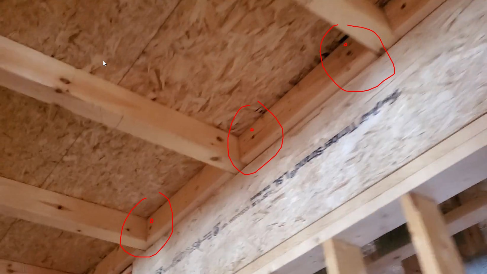
  - 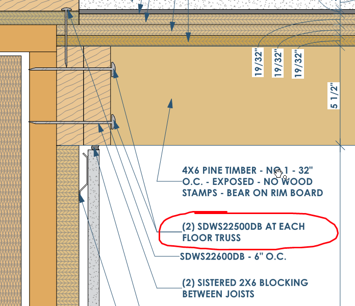

- Install a built-up column of at least (3) 2x6's at all LVL beams throughout project.  Example condition...
  
  - 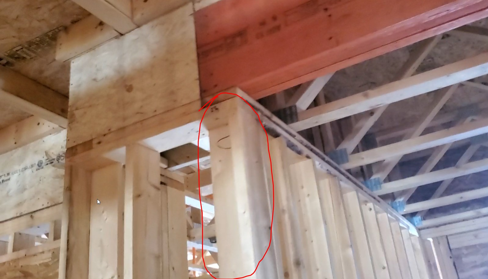
  - 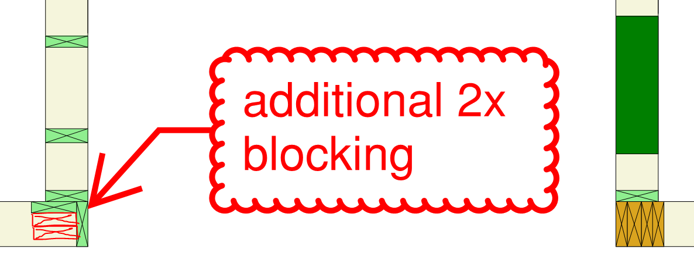

- At Stairs
  
  - need (3) SDWS22600DB - SDWS STRUCTURAL SCREWS @ EACHVERTICAL STUD at the ledgers that bear multiple joists
  
  - need (2) SDWS22600DB - SDWS STRUCTURAL SCREWS @ EACH VERTICAL STUD at ledgers that do not bear joists
  
  - 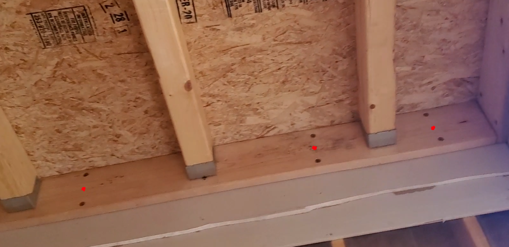
  
  - 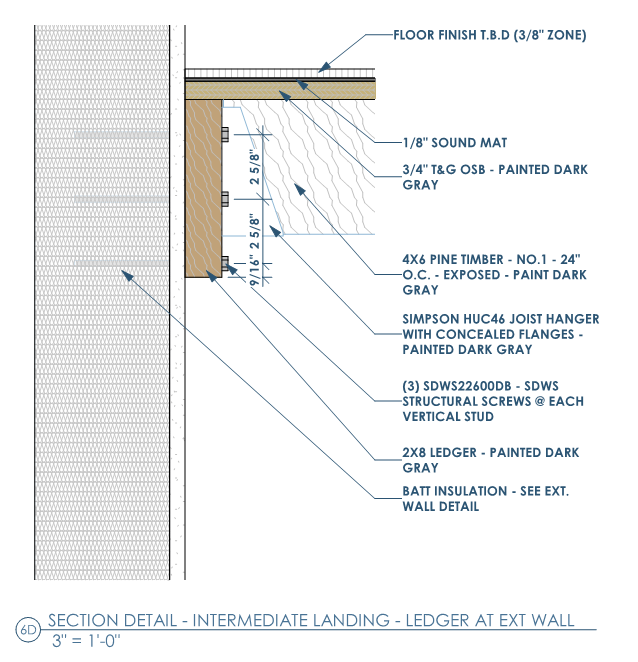

- Add additional sistered studs at column near LVL at elevator on 1st floor
  
  - 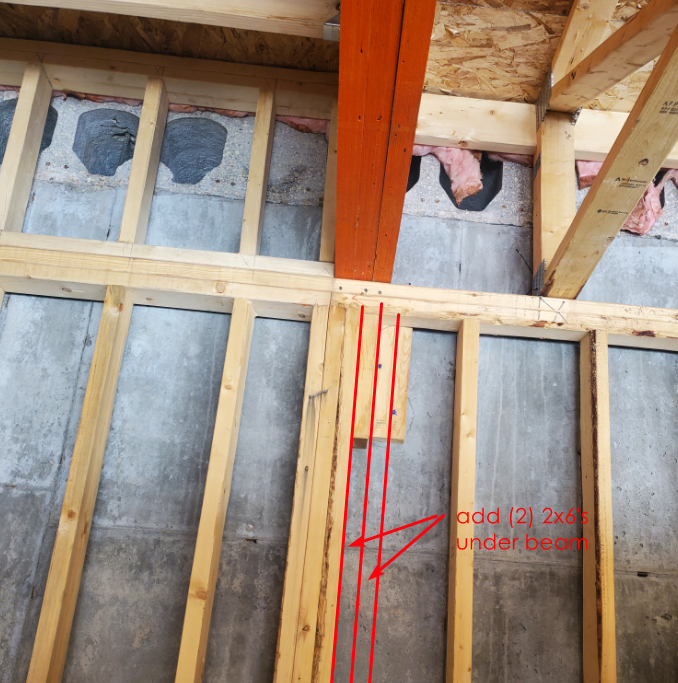

- At 3rd floor stair: Not enough room to slide (2) layers of drywall and 1/2" resilent channel between truss and stud.  Either move the truss or wrap truss with (2) layers of 5/8" Gyp. Bd--to continue 2hr wall up to deck.
  
  - 

- Spacing of 4x6's at roof at/near stair is incorrect.  Need to be 24" o.c. at stair. 16" o.c. outside stair at corrido--to support the condensing units on the roof.
  
  - 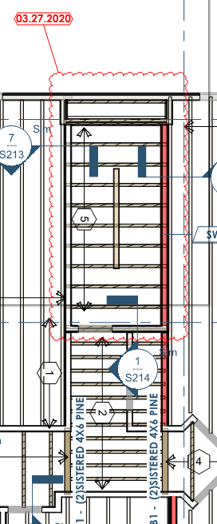
  
  - 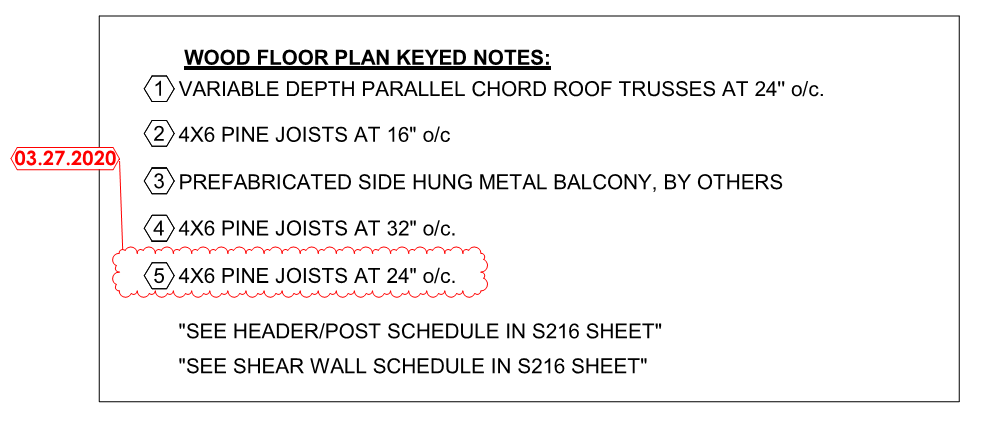

- Add (2) additinal 2x10 at the following corner (near elevator) at both the 2nd and 3rd floors to transfer load down to 2nd floor steel beam
  
  - 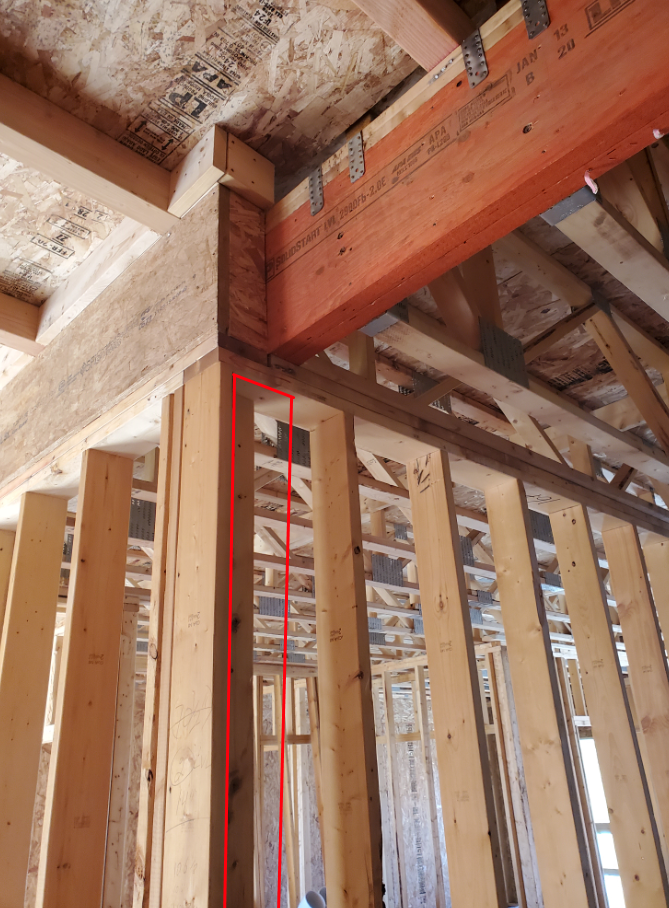
  - 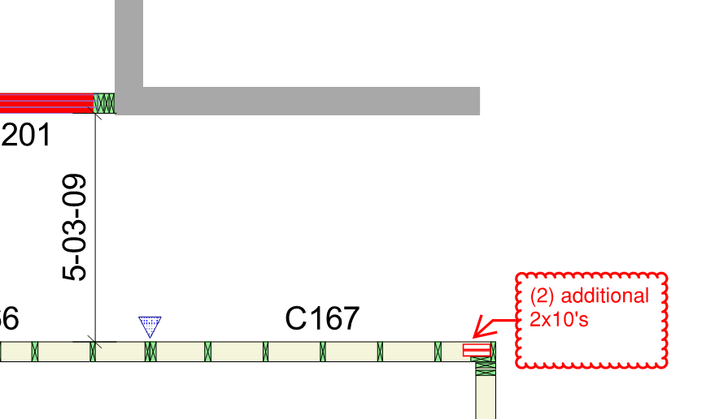

- Blocking at these conditions, similar to hallway, for the drywall to die into
  
  - 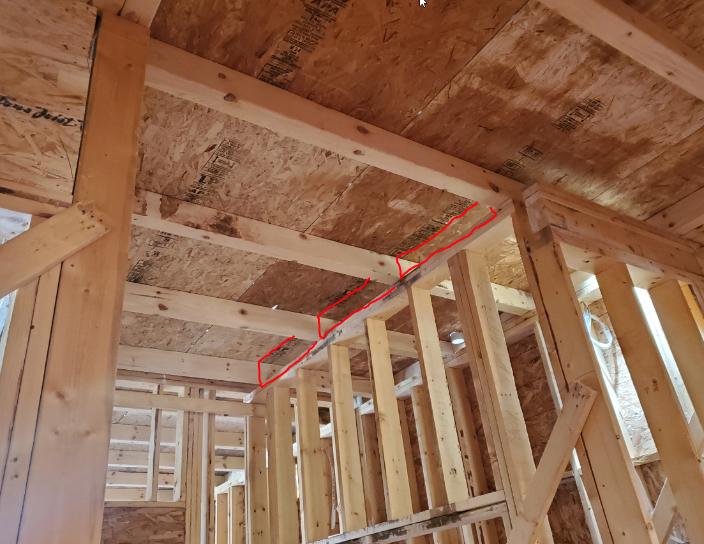

- Blocking at entry to support load of balcony load down through wall studs
  
  - 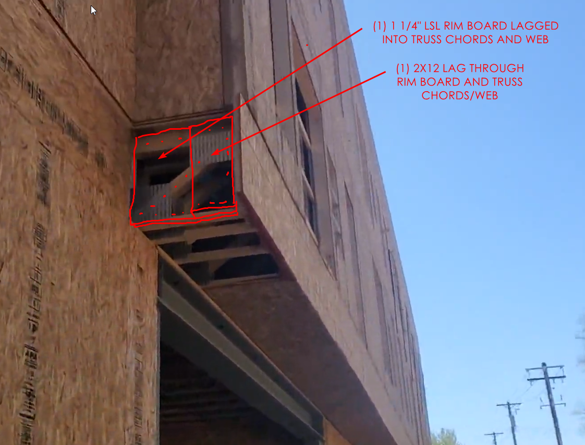

- Add 2x ledger at elevator CMU to support floor sheathing
  
  - 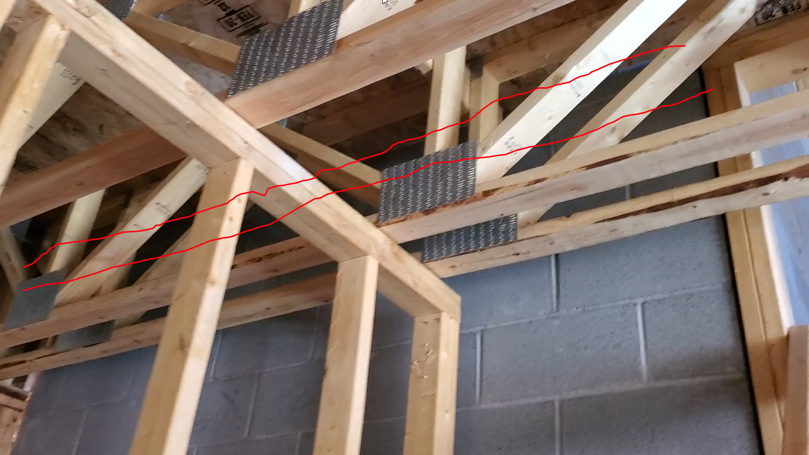
  - 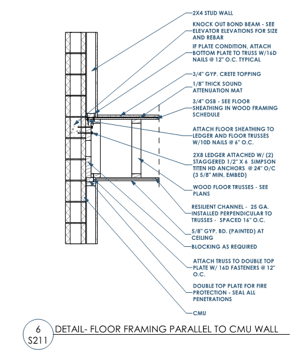

- Roof trusses need tie downs at all conditions on exterior and interior bearing walls--install was in progress.

<!--stackedit_data:
eyJoaXN0b3J5IjpbMTEzOTY2NDIzNiwyMDkwNDAxMjA0LDIxND
U4NDE2NzIsLTEwOTMzNDExMzJdfQ==
-->