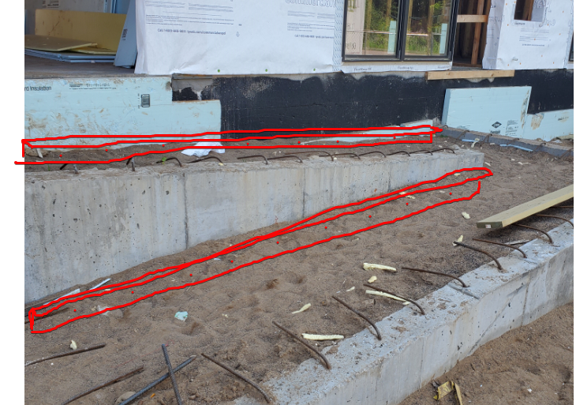
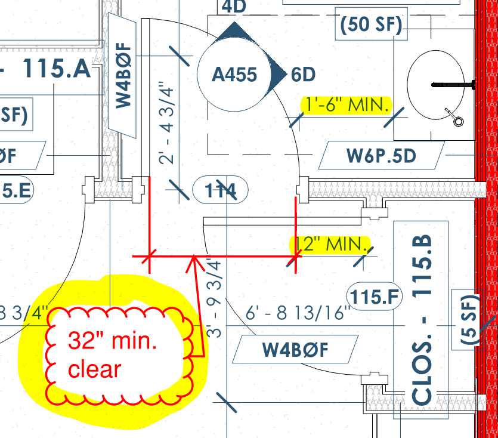
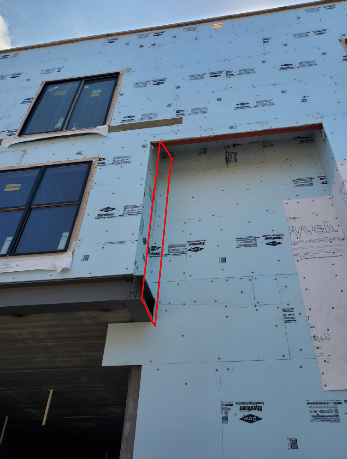
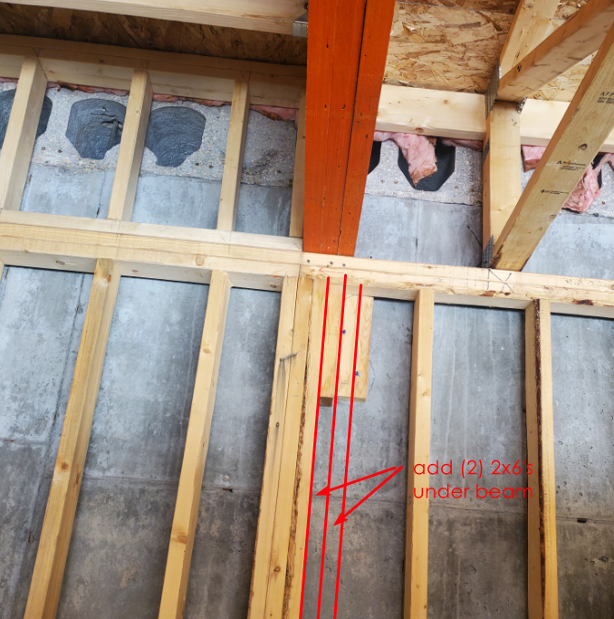
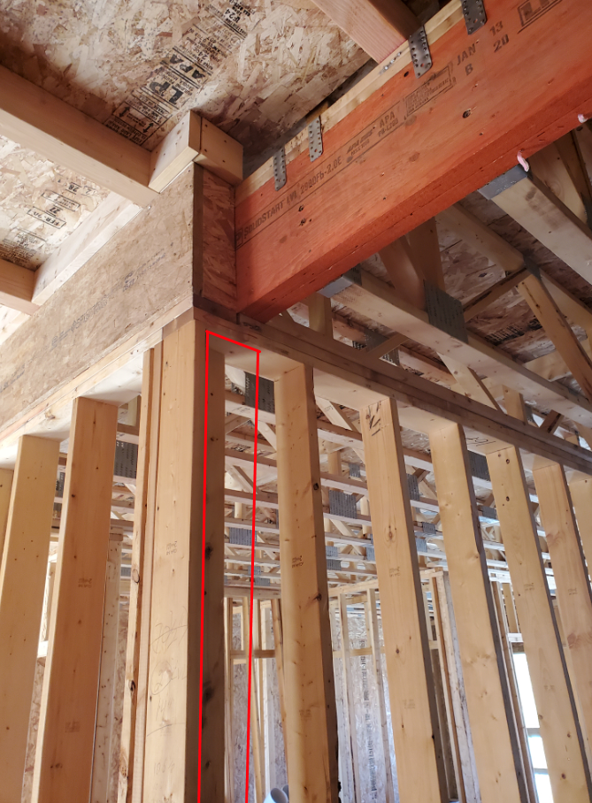
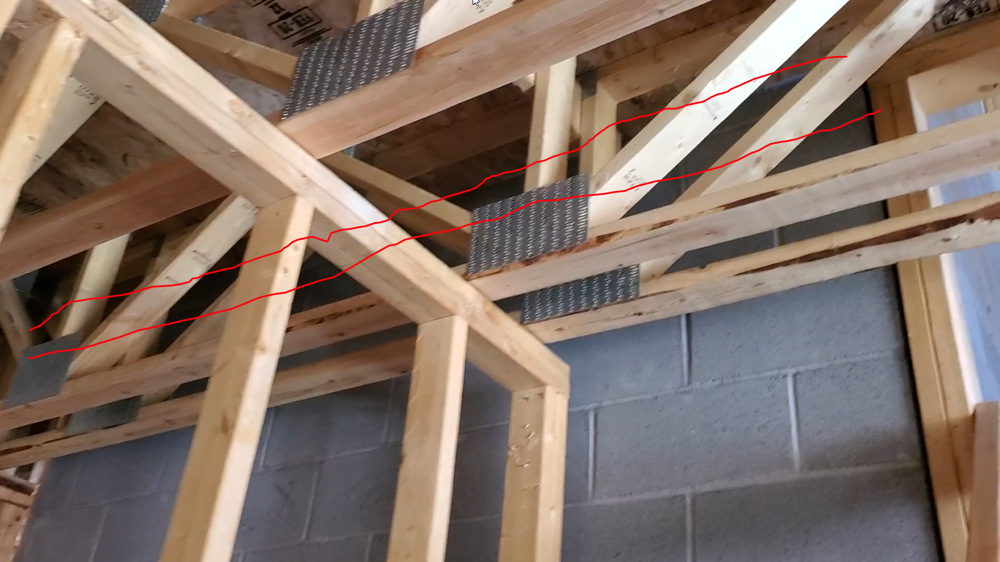
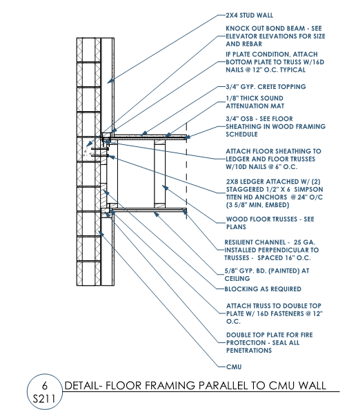

## The Current: Site Report: 07.24.2020

- Holddowns at the 2nd and 3rd floors, for both the east and west stair need to be installed.

- The inspector, will most likely require that this 'dead space' under the stairs be closed off with drywall.  Will most likely require a spinkler as well.  Confirm with Fire Protection engineer.
  
  - 

- Bear concrete slab on 3"x3"x1/4" galv angle attached with 5/8"x5" galv. anchor bolts at 24" o.c."
  
  - 

- Assure the following clearances at Restroom 114
  
  - 

- Furr out wall to hide steel on the north elevation
  
  - 

- Clean all the exposed CMU with wire brush to remove smears of surface mortar. 
  
  - 

- tighten bolts at all hold downs
  
  - 

- Missing fasteners at a few hanger locations throughout the various stair well stringers.
  
  - 

- Please take care to cover exposed concrete and/or CMU from over spray of stair paint. 
  
  - 
  
  
  
  ---
  
  ### 
  
  ### Outstanding from previous site report.

- Add additional sistered studs at column near LVL at elevator on 1st floor
  
  - 
  
  - 

- Add (2) additinal 2x10 at the following corner (near elevator) at both the 2nd and 3rd floors to transfer load down to 2nd floor steel beam
  
  - 

- Add 2x ledger at elevator CMU to support floor sheathing
  
  - 
  - 